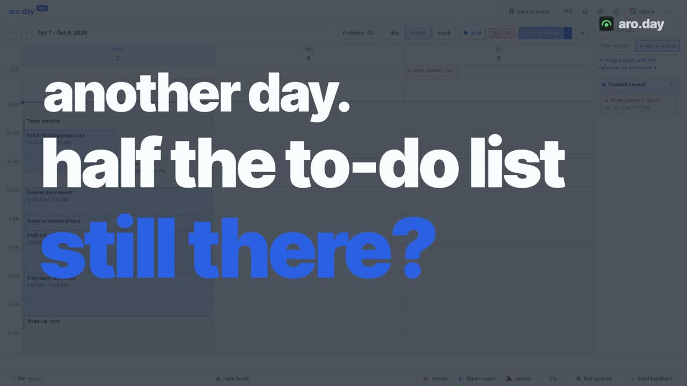

# saas-video-ad-skill

A Claude Code skill that turns your **real web app** into short promotional ads (15–40s).
It films the actual product from its production build with seeded data, then cuts it into
an ad: kinetic type, full-screen app footage with text overlays, a voice-over that drives
every cue, word-synced subtitles, an ambient bed and UI sound effects. Everything renders
locally with [HyperFrames](https://github.com/heygen-com/hyperframes).

It asks you for the style, colours, voice and storyline (or drafts them for you and lets
you pick), and it never uses mock UI.

**Built on research and on real feedback.** The rules come from two places:
1. **Published ad research.** Google/Kantar's ABCD framework, Meta, TikTok and LinkedIn
   creative guidance, Wistia and Vidyard retention data, AES/IAB loudness standards and
   Netflix subtitle timing. Summarised with sources in
   [`references/best-practices.md`](references/best-practices.md).
2. **A founder's notes on six rounds of real cuts.** Every correction became a rule in
   [`references/lessons.md`](references/lessons.md), and a check in the automated critic.
   Where the research and the notes disagree, the notes win, and the resolution is
   written down.

## Example

[](examples/aroday-it-fits/aroday-it-fits.mp4)

▶ [examples/aroday-it-fits/aroday-it-fits.mp4](examples/aroday-it-fits/aroday-it-fits.mp4): a 24s ad for
[aro.day](https://aro.day)'s day-capacity meter. Every frame of the product is the real app.
How it was made, and the six rounds of notes that shaped it: [examples/aroday-it-fits](examples/aroday-it-fits).

## How it works

```
intake (style · colours · voice · story)          references/intake.md
   ↓
script — hooks, whole-number maths, TTS spelling   references/script.md
   ↓
capture — real app, seeded, one take per beat      video-demo  ·  references/capture.md
   ↓            measure events: scripts/cuts.sh
storyboard + voice (HeyGen / Kokoro) + ambient + SFX     HyperFrames product-launch-video
   ↓            pad lines to the footage: scripts/pad-voices.mjs
build — bake shots, frames from word cues,         scripts/build.sh
        subtitles, assemble, overlays above footage
   ↓
render + verify the MP4 (footage count, audio,      scripts/render.sh
        thumbnail, frame strip)
```

The voice's word timestamps are the clock. Change a line or the voice speed, rebuild, and
every overlay, highlight ring and cut re-times itself.

## Critique, built in

Every cut gets reviewed before you see it:
- **`critique.mjs`** checks each rule and quotes the note or research it comes from:
  comparison hooks, AI-sounding phrases, fractional numbers, brand pronunciation, voice
  pace, payoff hold, voice landing before its on-screen event, zoom during a gesture, cuts
  inside a gesture, subtitle length and hold time, brand within 5s, a missing CTA, a blank
  thumbnail and loudness. FAILs block the cut.
- **A fresh-eyes visual pass** (`review-sheet.sh` + [`references/critique.md`](references/critique.md))
  writes blunt, timestamped notes in the founder's voice.

## Fast

`scripts/ad.sh` runs the pipeline one stage at a time, with timings. Voice, music and
SFX are cached by content hash, so unchanged lines are never re-bought. Shots bake in
parallel. `ad.sh new` scaffolds the next ad from the previous one.
A full rebuild of the example takes about 30s of machine time (render ≈ 22s).

## Requirements

- [Claude Code](https://claude.com/claude-code)
- Node ≥ 22, ffmpeg
- [video-demo](https://github.com/nilbuild/video-demo) skill: `npx skills add nilbuild/video-demo`
- HyperFrames CLI + skills: `npx hyperframes skills update product-launch-video`
- Optional: a HeyGen account (`npx hyperframes auth login`) for better voices and a music
  library. Without it, voice and music use local engines (Kokoro / MusicGen).

## Install

```bash
git clone https://github.com/MotazAbuElnasr/saas-video-ad-skill ~/.claude/skills/saas-video-ad
```

## Use

Ask Claude Code from your app's repo:

```
make a 25s promo ad for this app showing <the feature>
make three ad variations for <feature>, male voice, our brand colours
re-cut the ad: hold longer after "Done", slower voice
```

The skill asks for anything it can't infer: storyline or script (yours verbatim, or
drafted with 5–7 hook options), format (16:9 / 1:1 / 9:16), style (your brand or a preset),
colours, voice, music, subtitles and end card. It then shows the script as a table for
approval before it films or buys any TTS.

## Layout

| Path | What |
|---|---|
| [`SKILL.md`](SKILL.md) | the run, step by step, with gates |
| [`references/`](references) | intake questions, script rules, capture guide, **best practices (research + sources)**, **lessons learned**, the critique rubric |
| [`scripts/`](scripts) | `ad.sh` (one command per stage), timing, shot baking, cached voice, voice pads, caption merge, frame kit, critic, build / render / measure |
| [`templates/`](templates) | `ad.config.mjs`, `gen-frames.mjs`, `capture.scene.ts` |
| [`examples/aroday-it-fits/`](examples/aroday-it-fits) | a complete ad: config, frames, storyboard, script, capture scenes, the MP4 |

## Lessons baked in

From the session that made the example ([full list](references/lessons.md)):

- **Full screen by default; zoom only with a reason.** Zoom to make something small
  readable, never during a gesture. Text goes in overlay cards and a ring marks the focus.
- **No cut inside a gesture.** Cause → effect is one take.
- **Hold the payoff** for 1–1.5s.
- **Voice lands after the event it names.**
- **Whole numbers that add up in the viewer's head.**
- **No comparison openers, no AI-isms.**
- **Natural voice speed; spell the brand for TTS and show it written in subtitles.**
- **Frame 0 is the thumbnail.** Brand visible throughout.
- **Verify the final MP4, not the preview.**

## Research sources

The full list with what each one supports is in [`references/best-practices.md`](references/best-practices.md). Key ones:
- Google / Kantar — [ABCDs of effective video ads](https://www.thinkwithgoogle.com/_qs/documents/15987/ABCDs_PDFPlaybook_April2022_Final.pdf), [creative guidance](https://support.google.com/google-ads/answer/13812351), [ABCDs detector](https://github.com/google-marketing-solutions/abcds-detector)
- Meta — [video ad features](https://www.facebook.com/business/news/updated-features-for-video-ads), [Reels ads guide](https://www.facebook.com/business/ads-guide/update/image/instagram-reels)
- TikTok — [creative best practices](https://ads.tiktok.com/help/article/creative-best-practices), [what drives conversions](https://ads.tiktok.com/business/en-US/blog/creative-that-drives-conversions)
- LinkedIn — [video ad specs](https://www.linkedin.com/help/linkedin/answer/a424737), [tips for video ads](https://www.linkedin.com/business/marketing/blog/linkedin-ads/4-tips-for-better-video-ads-on-linkedin-in-2021)
- YouTube — [ad formats](https://support.google.com/displayvideo/answer/6274216), [Shorts specs](https://support.google.com/google-ads/answer/16041697), [thumbnails](https://support.google.com/youtube/answer/72431)
- Kantar — [15s vs 30s spots (2026)](https://www.kantar.com/north-america/company-news/kantar-super-bowl-ad-study-15-second-ads-match-30-second-spots)
- [Wistia: optimal video length](https://wistia.com/learn/marketing/optimal-video-length) · [Vidyard: video benchmarks](https://www.vidyard.com/business-video-benchmarks/)
- Loudness — [AES TD1004](https://aes.org/wp-content/uploads/2024/01/AESTD1004_1_15_10.pdf), [IAB Tech Lab CTV guidelines](https://github.com/InteractiveAdvertisingBureau/Ad-Format-Guidelines-for-Digital-Video-CTV/blob/main/v2.0.md)
- [Netflix Timed Text Style Guide](https://partnerhelp.netflixstudios.com/hc/en-us/articles/217350977-English-USA-Timed-Text-Style-Guide) (subtitle reading speed)

## Credits

Built on [HyperFrames](https://github.com/heygen-com/hyperframes) (HeyGen) and
[video-demo](https://github.com/nilbuild/video-demo) (Kamran Ahmed).
