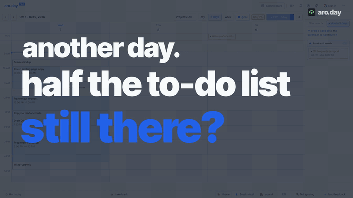
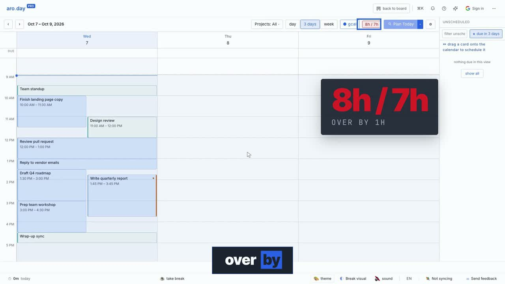

# Example — aro.day "It fits" (23.9s, 16:9)

▶ **[aroday-it-fits.mp4](aroday-it-fits.mp4)**, with sound: real app footage, HeyGen voice (Ewan), ambient bed,
UI sounds, subtitles. The GIF is a silent preview, because GitHub only plays videos uploaded through its web editor.

| # | On screen | Voice |
|---|---|---|
| 1 | **another day. / half the to-do list / still there?** over the dimmed real calendar (frame 0 = thumbnail) | "Another day. Half the to-do list still there?" |
| 2 | The app full screen; card **7h for real work · 1h free**; ring on the 6h / 7h meter | "Maybe it never fit. aro dot day shows you: seven hours for real work, just one still free." |
| 3 | One take: grab the 2h report, drag onto today, the real "Scheduling conflict" dialog; **+2h** | "Add a two-hour report, and it warns you before it breaks your day." |
| 4 | Same take: "Schedule anyway", the meter turns red, ring + card **8h / 7h · over by 1h** | "Over by an hour. You see it now." |
| 5 | Drag it to Thursday, the meter is back to 6h / 7h; **done.**, 1.5s hold | "Drag it to Thursday. Done." |
| 6 | End card on ink: mark, **aro.day**, "plan a day that actually **fits.**" | "aro dot day. Plan a day that actually fits." |

## Files

| File | Goes to | What |
|---|---|---|
| `BRIEF.md`, `STORYBOARD.md`, `SCRIPT.md` | project root | the locked brief, beats and words (with the user's notes in "Changes from v1") |
| `ad.config.mjs` | project root | brand, palette, footage marks, shots, voice pads, caption merge |
| `gen-frames.mjs` | `.hyperframes/` | the six frames, every time a word cue or a footage mark |
| `capture/demo.config.ts`, `mock.ts` | video-demo workspace | build, seeded storage, mocked network for the aro.day repo |
| `capture/state.ts` | workspace `seed/` | the seeded app state (7h of work after 2h of meetings) |
| `capture/ad-fit.scene.ts` | workspace `scenes/` | three one-take scenes: the day, drag → conflict → red, move to Thursday |

## How it went from v1 to v6
The user's notes, in order: too slow and robotic → promo style; no comparison opener; male
voice; ambient rather than music; zoom misses things; cut mid-drag; maths didn't add up (twice);
AI-sounding phrase; brand mispronounced; no accent end card; needs a thumbnail; app full
screen with overlays; "Done" too short; voice ahead of the event; slower voice; subtitles.
Each one is now a rule in [`references/lessons.md`](../../references/lessons.md).
